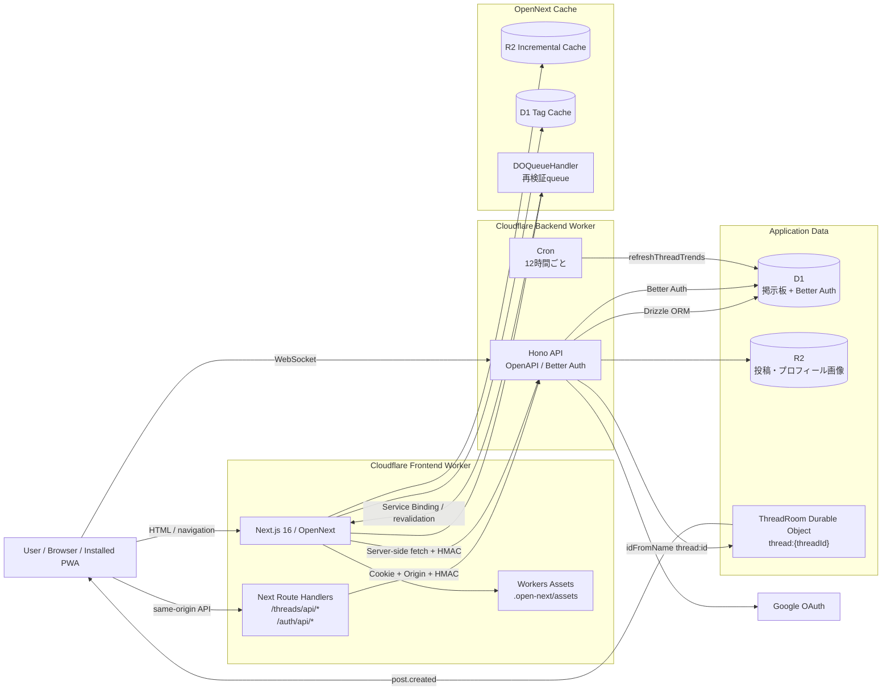
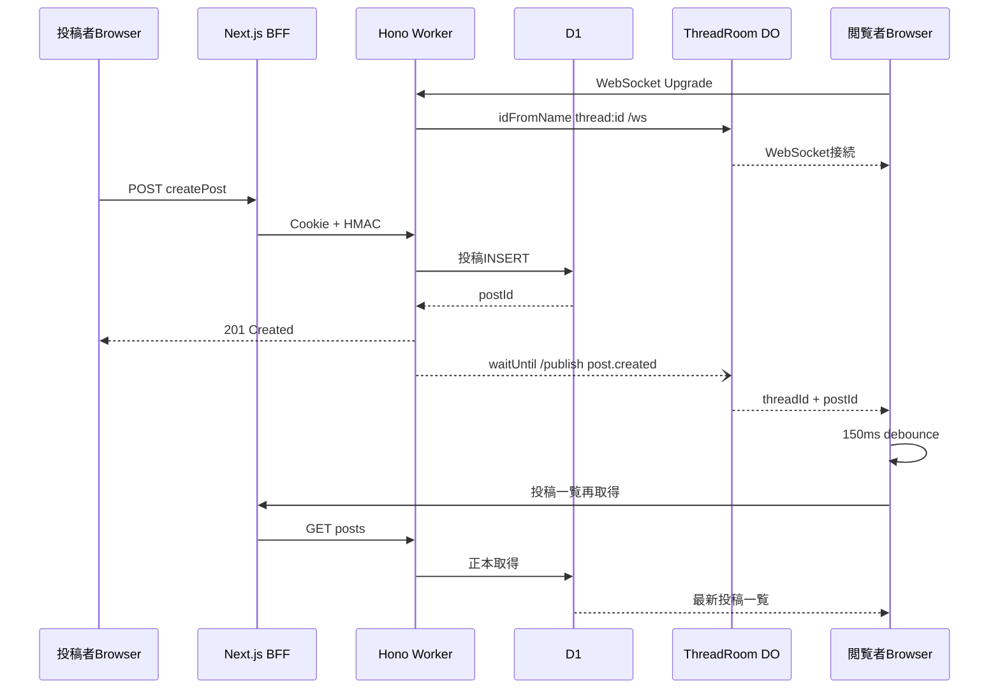
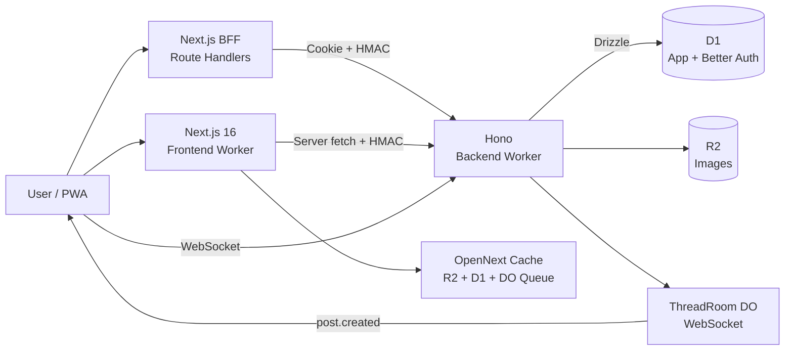

# コトバド 技術プレゼン調査資料

- 調査日: 2026-08-10（認証・Turnstile・Backend build・CI関連は2026-08-13再確認）
- 対象ブランチ: `main`
- 対象リポジトリ: `kotobad`
- 調査方針: 実装・設定を優先し、未確認事項は未確認と明記する

## Summary

- コトバドは、バドミントンに関するスレッドと投稿を扱う掲示板です。
- FrontendはNext.js 16をOpenNextでCloudflare Workersへ配信します。
- BackendはHonoをCloudflare Workers上で実行します。
- 掲示板データと認証sessionはD1へ保存します。
- 画像はR2へ保存します。
- 新規投稿通知にはWebSocketとDurable Objectsを使います。
- FrontendとBackendは共有Zod schemaをAPI契約として利用します。
- PWAはstandalone起動に対応しますが、offline cacheとWeb Pushは未実装です。
- BackendにBunの初期回帰テストとGitHub Actions CIを追加しました。Frontendの自動テスト、統合テスト、E2Eは未実装です。

## Background

- 本資料は、コトバドについて「何を作ったか」だけでなく、技術構成、型安全性、リアルタイム処理、キャッシュ、障害対応、UXを面接で説明するための調査資料です。
- `AGENTS.md`の概要にはNext.js 15とありますが、現行`package.json`はNext.js 16.2.9です。
- 本資料では現行コードと設定を優先します。

## Goals

- 実際に使用している技術を、packageの存在だけでなく実装利用まで確認します。
- システム構成をFrontend、Backend、Database、Storage、Authentication、WebSocketの関係で整理します。
- TypeScript、Hono、Zod、Drizzleによる型安全性の範囲を説明します。
- Cloudflare各サービスの役割を説明します。
- WebSocketとDurable Objectsの実装を説明します。
- キャッシュと静的アセット障害対策を説明します。
- スマートフォン向けUX実装を説明します。
- 面接スライド用の要約と想定質問を作成します。

## Non-Goals

- 本資料ではコード改善を実施しません。
- Cloudflare Dashboardの外部設定は断定しません。
- production secretsの値は確認しません。
- 実際のCloudflare料金や無料枠利用額は推測しません。
- 実装から確認できない本人の技術選定理由は断定しません。

## Scope

- `package.json`
- `packages/frontend/package.json`
- `packages/backend/package.json`
- `packages/shared/package.json`
- FrontendのApp Router、Route Handler、UI、PWA、cache指定
- BackendのHono route、middleware、認証、DB処理、WebSocket
- Drizzle schemaとBetter Auth schema
- FrontendとBackendのWrangler設定
- OpenNext設定
- 静的アセット保全script
- Git hooks、lint、format、test、CI設定
- `docs/`内の関連incidentとperformance資料

## Verification

- `bun run typecheck`: Frontend、Backend、Sharedすべて成功しました。
- `bun run build:frontend`: 成功しました。
- Frontend build時はローカルBackendが起動していなかったため、タグ取得は実装どおり空配列へfallbackしました。
- 2026-08-13の認証修正後もFrontend / Backendのtypecheck、Frontend buildに成功しました。Next.js BFF経由で`get-session`と`sign-in/social`が200となり、後者がGoogle認可URLを返すことを確認しました。Google callback完了後のsession確立は、実Googleアカウント操作を行っていないため未確認です。
- `bun run build:backend`: BackendのWrangler dry-run（minify、トップレベルbindings）として成功しました。
- `bun run test`: BackendのZodエラーフォーマット回帰テスト2件が成功しました。GitHub Actionsの実行結果自体は未確認です。
- `git status --short --branch`: 調査開始時はcleanでした。
- Cloudflare本番環境、Dashboard設定、remote migration適用状態は未確認です。

## 1. 技術スタック

| 分類 | 実利用を確認した技術 | 実装上の用途 | 根拠 |
| --- | --- | --- | --- |
| Frontend | Next.js 16.2.9、React 19.2.6、TypeScript 6 | App Router、Server Component、Client Component、Route Handler | `packages/frontend/package.json:41-43,63` |
| Frontend data | SWR、`swr/immutable` | 投稿、通知、リアクション候補、BWF live demo | `packages/frontend/src/app/threads/[id]/components/ThreadPostsStream.tsx:21-30` |
| Frontend form | React Hook Form | 投稿、スレッド、プロフィール等のフォーム | `packages/frontend/src/app/threads/[id]/components/CreatePostForm.tsx:5-8` |
| Backend / API | Hono 4、`@hono/zod-openapi`、Swagger UI | Worker API、middleware、OpenAPI | `packages/backend/package.json:20-27` |
| Database | Cloudflare D1、Drizzle ORM、Drizzle Kit | 掲示板、認証、通知、トレンド | `packages/backend/src/database.ts:1-14` |
| Authentication | Better Auth、Google OAuth、D1 session | Login、session検証、Cookie認証 | `packages/backend/src/auth.ts:75-125` |
| Validation / Schema | Zod 4、`@hono/zod-openapi`、`@kotobad/shared` | Request、Response、OpenAPI、`z.infer` | `packages/shared/src/schemas` |
| Realtime | WebSocket、Durable Objects、SWR | 新規投稿通知と投稿一覧再取得 | `packages/backend/src/realtime` |
| Storage | Cloudflare R2 | 投稿、スレッド、プロフィール画像 | `packages/backend/src/routes/bbs/media/methods/upload.ts:169-177` |
| Infrastructure | Cloudflare Workers、OpenNext、Workers Assets | FrontendとBackendの実行、static asset配信 | `packages/frontend/wrangler.jsonc`、`packages/backend/wrangler.jsonc` |
| PWA | Manifest、Service Worker、Apple PWA metadata | standalone起動、icon、startup image | `packages/frontend/src/app/manifest.ts` |
| Styling / UI | Tailwind CSS 4、Radix UI、CVA、Motion、Framer Motion、Lottie、Sonner | Responsive UI、dialog、animation、toast | `packages/frontend/package.json:23-52` |
| Lint / Format | Biome | Format、lint、import整理 | `biome.json` |
| Git hooks | Husky、lint-staged | Pre-commitでstaged TS/TSXにBiome | `.husky/pre-commit`、`package.json:43-47` |
| 開発ツール | Bun workspaces、Wrangler、Drizzle Kit、Knip、Docsify、Scaffdog、mise | Dev、deploy、migration、文書生成 | `package.json:21-41` |

### 1.1 実利用を確認できないもの

- `@opentelemetry/api`は`packages/frontend/package.json:22`にあります。
- Repository内の直接importと独自計装設定は確認できません。
- OpenTelemetryを独自導入済みとは説明できません。
- `@tailwindcss/line-clamp`は`tailwind.config.ts`に設定があります。
- Tailwind CSS 4の現行buildで旧configが読み込まれることは、repositoryの読み取りだけでは確認できません。
- BackendにはBun testによるZodエラーフォーマットの回帰テストがあります。Frontendのtest runner、統合テスト、E2Eは確認できません。
- `.github/workflows/ci.yml`でtest、typecheck、Biome、Backend build、Frontend buildを実行する設定です。

### 1.2 実装済みと誤認しないもの

- BackendではBetter Authのemail/passwordが有効です。
- 現行Frontendのsign-in / sign-up画面はGoogle OAuthだけを表示します。
- Google OAuth開始失敗時はtoastを表示し、`finally`でbuttonのloading状態を解除します。
- RuntimeにJWT発行・検証実装はありません。
- `AppType`はexportされていますが、Hono RPC clientは使われていません。
- `packages/frontend/src/app/threads/[id]/components/chat`は現行route treeからimportされていません。
- 現行thread詳細は`ThreadPostsStream`、`PostList`、`ThreadPostListView`を使用します。
- `drizzle/schema.ts`の複数形`users`テーブルはruntime queryでの利用を確認できません。
- 現行認証はBetter Authの単数形`user`テーブルを使用します。

## 2. システム構成



### 2.1 HTTP request flow

- Browserは`/threads/api/*`または`/auth/api/*`を呼びます。
- Next.js BFFはCookie、Origin、method、body、queryをBackendへ転送します。
- 通常のBBS requestにはHMAC-SHA-256署名を追加します。
- Hono BackendはHMAC、Origin、必要なsessionを検証します。
- BackendはDrizzle経由でD1を操作します。
- Frontend BFFは多くのrequestとresponseを共有Zod schemaで検証します。
- HMAC実装は`packages/frontend/src/lib/api/security/ensureInternalSecret.ts`です。
- Backend検証は`packages/backend/src/middleware/internal-auth.ts`です。

### 2.2 API一覧

- OpenAPIとして登録されるBBS APIは18本です。
- Threadsは一覧、詳細、検索、トレンド、作成、いいねを扱います。
- Postsは一覧、作成、リアクション候補、リアクション設定を扱います。
- Usersはプロフィール、選手検索、プロフィール更新を扱います。
- MediaはR2画像uploadを扱います。
- Notificationsは一覧、未読数、全既読を扱います。
- Labelsはタグ一覧を扱います。
- 登録箇所は`packages/backend/src/routes/bbs/index.ts:14-40`です。
- WebSocket routeは`GET /bbs/realtime/threads/:threadId/ws`です。
- Better Authは`/better-auth/*`へ登録されます。
- OpenAPI JSONは`/specification`です。
- Swagger UIは`/doc`です。
- `/doc`は現行source literalのBasic Authで保護されます。

### 2.3 認証が必要なAPI

- Thread作成
- Threadいいね
- Post作成
- Postリアクション設定
- Notification操作
- User profile更新
- Media upload
- Realtime WebSocket routeにはBetter Auth middlewareがありません。
- Realtime routeはHMAC検証から明示的に除外されます。
- Realtime routeにはmodule-level memoryのrate limitがあります。

### 2.4 D1 schema

- Better Authのテーブルは`user`、`session`、`account`、`verification`です。
- 掲示板の主なテーブルは`threads`、`posts`、`thread_images`、`post_images`です。
- Tag関連は`tags`、`thread_tag`です。
- Reaction関連は`reactions`、`post_reactions`です。
- Likeは`thread_likes`です。
- Notificationは`notifications`です。
- Trendは`thread_trends`です。
- Player関連は`players`、`user_favorite_players`、`careers`、`achievements`です。
- Better Auth schemaは`packages/backend/drizzle/better-auth.schema.ts`です。
- Application schemaは`packages/backend/drizzle/schema.ts`です。

### 2.5 DB制約

- `(threadId, localId)`でthread内投稿番号をunique化します。
- 投稿返信は`posts.replyToPostId`の自己参照です。
- Post reactionは`postId + reactionId + userId`でuniqueです。
- Thread likeは`threadId + userId`でuniqueです。
- Thread tagは`threadId + tagId`でuniqueです。
- Notification typeはcheck constraintを持ちます。
- Imageは親IDと`sortOrder`でuniqueです。

## 3. TypeScript / Hono / Zod

### 3.1 Hono Contextの型

- `AppEnvironment`がWorker bindingを型定義します。
- BindingにはD1、R2、Durable Object、Better Auth、HMAC、Turnstile関連を含みます。
- Context variableには`db`と`betterAuthUser`を含みます。
- `db`は`DrizzleD1Database<typeof schema>`です。
- `packages/backend/src/types.ts:5-35`が根拠です。
- DB middlewareは`c.set("db", db)`を実行します。
- Better Auth middlewareは`c.set("betterAuthUser", payload)`を実行します。

### 3.2 Hono routeとhandler型

- APIは`createRoute()`でmethod、path、request、responseを定義します。
- Handlerは`RouteHandler<typeof route, AppEnvironment>`で型付けします。
- Validation後のrequestは`c.req.valid("json")`または`c.req.valid("query")`で取得します。
- 投稿作成の実例は`packages/backend/src/routes/bbs/posts/methods/create.ts:18-105`です。
- Thread routeの登録は`packages/backend/src/routes/bbs/threads/index.ts:17-23`です。

### 3.3 Shared Zod schema

- Shared packageはThread、Post、User、Notification、Tag、Media、Reaction、Error schemaを管理します。
- `ThreadType`は`ThreadSchema`から`z.infer`します。
- `PostType`は`PostSchema`から`z.infer`します。
- Backendは共有schemaへ`.openapi()`を付けます。
- Frontend BFFはrequestとresponseを同じschemaでparseします。
- `packages/shared/src/schemas/thread.ts`がThread契約です。
- `packages/shared/src/schemas/post.ts`がPost契約です。
- `packages/backend/src/models/threads.ts`がOpenAPI登録例です。
- `packages/frontend/src/app/threads/api/posts/createPost/route.ts`がFrontend境界のparse例です。

### 3.4 Drizzle schemaとの連携

- `drizzle(env.DB, { schema })`へschema全体を渡します。
- Drizzle queryはtable columnとrelationをschemaから型推論します。
- DB rowは`toThreadResponse()`と`toPostResponse()`でAPI型へ変換します。
- `Date`はISO stringへ変換します。
- Image relationは`imageUrls`へ変換します。
- Viewerに応じて`likedByMe`と`isMine`を付与します。
- Tag iconのcolumn型には`TagIconKindType`を利用します。
- Notification typeのcolumn型には共有`NotificationType`を利用します。

### 3.5 型安全性の範囲

- DB schemaからZod schemaを自動生成していません。
- Hono RPC clientを使っていません。
- `BffFetcher<T>`自体は`response.json() as Promise<T>`です。
- Runtime safetyは各BFFと呼び出し箇所の`parse`または`safeParse`が担います。
- WebSocket payloadは現行ではZod parseではなくTypeScript castです。
- Shared packageは多くの箇所でdeep importされます。
- 正確な説明は「共有Zod schemaをAPI契約として再利用している」です。
- 「FrontendからDBまで完全自動の型安全」とは説明しません。

## 4. Cloudflare構成

| サービス | 用途 | 機能 | 根拠 |
| --- | --- | --- | --- |
| Frontend Worker | Next.js実行 | App Router、SSR、Route Handler | `packages/frontend/wrangler.jsonc:3-16` |
| Backend Worker | Hono API実行 | API、認証、Cron | `packages/backend/src/index.ts:57-78` |
| D1 `DB` | Application DB | 掲示板、認証、通知、トレンド | `packages/backend/wrangler.jsonc:9-15` |
| D1 `NEXT_TAG_CACHE_D1` | OpenNext tag cache | Next cache tag管理 | `packages/frontend/wrangler.jsonc:40-46` |
| R2 `KOTOBAD_BUCKET` | Application image | Thread、Post、Profile image | `packages/backend/wrangler.jsonc:24-30` |
| R2 `NEXT_INC_CACHE_R2_BUCKET` | OpenNext incremental cache | Next cache entry | `packages/frontend/wrangler.jsonc:26-30` |
| Durable Object `ThreadRoom` | Realtime room | Thread単位のWebSocket fan-out | `packages/backend/src/realtime/thread-room.ts` |
| Durable Object `DOQueueHandler` | OpenNext cache | Revalidation queue | `packages/frontend/wrangler.jsonc:32-39` |
| Workers Assets | Static asset | `.open-next/assets`配信 | `packages/frontend/wrangler.jsonc:10-13` |
| Cron Trigger | Trend calculation | 12時間ごとにD1更新 | `packages/backend/wrangler.jsonc:45-47` |
| Image Transform URL | Image delivery | format、quality、width、height、fit | `packages/frontend/src/lib/utils/cfImage.ts:105-142` |
| Turnstile | Bot verification | Server-side validatorのみ実装。Client側のwidget / token生成は未実装 | `packages/backend/src/middleware/turnstile.ts`, `packages/frontend/src/lib/api/security/turnstile.ts` |

### 4.1 OpenNext cache構成

```ts
incrementalCache: r2IncrementalCache,
queue: doQueue,
tagCache: d1NextTagCache,
enableCacheInterception: false,
```

- 設定は`packages/frontend/open-next.config.ts`です。
- R2 incremental cache、D1 tag cache、DO queueを使います。
- `enableCacheInterception: false`はcache interceptionを無効にします。
- R2、D1、DOによるcache構成全体が無効とは断定しません。

### 4.2 費用と運用の観点

- Frontend、API、SQL DB、object storage、WebSocket coordinationをCloudflareのmanaged serviceへまとめています。
- 常時起動VM、Kubernetes、外部RDB serverの設定はrepository内にありません。
- TrendはCronで事前計算します。
- Static assetとR2 imageは長期cacheします。
- WebSocketは`ctx.acceptWebSocket()`を使います。
- これらは運用対象を減らしやすい構成です。
- Cloudflareを費用目的で選んだ本人の理由は未確認です。
- 実際の料金、plan、free tier利用状況は未確認です。

### 4.3 確認できないCloudflare設定

- Dashboard側のBuild command
- WAF rule
- Dashboard側rate limit
- Turnstileのproduction scope
- Image Transformationsのaccount有効状態
- Cache Rule
- 実際のcache hit率
- Production secret
- Remote D1 migration適用状態

## 5. リアルタイム機能

### 5.1 リアルタイム対象

- 現在のeventは`post.created`だけです。
- Payloadは`type`、`threadId`、`postId`です。
- Like、Reaction、Presence、Typing、Notification countはWebSocket配信されません。
- 型は`packages/backend/src/realtime/types.ts`です。

### 5.2 処理フロー



### 5.3 Room単位

- Room名は`thread:${threadId}`です。
- `idFromName()`で同じthreadを同じDurable Objectへroutingします。
- 実装は`packages/backend/src/realtime/thread-event.ts:4-20`です。

### 5.4 ThreadRoomの役割

- `WebSocketPair`を作成します。
- `ctx.acceptWebSocket(server)`でsocketを受け入れます。
- `ctx.getWebSockets()`で接続中socketを列挙します。
- `/publish`で全socketへeventを送信します。
- `webSocketClose`でsocketをcloseします。
- 実装は`packages/backend/src/realtime/thread-room.ts:4-40`です。

### 5.5 ThreadRoomが使わないもの

- `ctx.storage`
- Durable Object SQL
- Alarm
- Post本文の永続化
- Event履歴
- Presence状態
- Clientからのmessage
- SQLite classとしてmigrationされていますが、ApplicationのThreadRoomは永続状態を利用しません。

### 5.6 Client接続管理

- API base URLの`https:`を`wss:`へ変換します。
- Open時にretry countをresetします。
- Error時にsocketをcloseします。
- Close後は1秒、2秒、4秒、8秒、最大10秒で再接続します。
- 再接続回数の上限はありません。
- Component unmount時にtimerを解除します。
- Socketもcloseします。
- 実装は`packages/frontend/src/app/threads/[id]/hook/useThreadPostRealtime.ts`です。

### 5.7 Errorと再接続の制約

- JSON parse失敗は無視します。
- Socket send失敗はDurable Object側で無視します。
- Publish request失敗はBackend logへ出します。
- Publish retryはありません。
- Heartbeatはありません。
- Connection timeoutはありません。
- Jitterはありません。
- Missed event replayはありません。
- WebSocket再接続直後の明示的な全件refetchはありません。
- User向け接続error表示はありません。

### 5.8 WebSocketとHTTPの役割分担

- WebSocket payloadを直接PostとしてUIへ追加しません。
- 現在表示中の最大Post IDより新しいeventだけを処理します。
- 150ms以内のeventをまとめます。
- SWRの`mutate()`で通常GETを再実行します。
- WebSocketは変更通知です。
- HTTPとSWRは正本取得です。
- D1はsource of truthです。
- 実装は`packages/frontend/src/app/threads/[id]/components/ThreadPostsStream.tsx:32-53`です。

### 5.9 なぜ通常APIだけではないか

- 本人の選定理由はrepositoryから確認できません。
- 実装上、通常APIだけでは手動更新またはpollingが必要です。
- WebSocketは接続中の閲覧者へ新規投稿を即時通知できます。
- Durable Objectsはthread単位でsocket集合をまとめます。
- Post本文をWebSocketへ二重保存せず、HTTPでD1の正本へ戻します。
- 面接では「通常APIを廃止した」とは説明しません。
- 面接では「通常APIを正本取得に残し、変更通知だけWebSocketにした」と説明します。

## 6. キャッシュ戦略

### 6.1 Cache layer

| Layer | 現行実装 | 根拠 |
| --- | --- | --- |
| Next fetch cache | Tag一覧だけ`force-cache` + `revalidate: 300` | `packages/frontend/src/app/threads/lib/getTags.ts:13-18` |
| Thread data | 一覧、詳細、検索、Trendは`no-store` | `packages/frontend/src/app/threads/lib` |
| Profile data | `no-store` | `packages/frontend/src/app/users/[id]/lib/getUserProfileById.ts` |
| Server fetcher | Defaultは`cache: "no-cache"` | `packages/frontend/src/lib/api/fetcher/bffFetcher.ts:68-72` |
| Backend Thread GET | `Cache-Control: no-store` | `packages/backend/src/routes/bbs/threads/methods/get.ts` |
| Client cache | SWR | `packages/frontend/src/app/threads/[id]/components/ThreadPostsStream.tsx`、`packages/frontend/src/components/feature/header/component/notification/useNotifications.ts` |
| OpenNext | R2 incremental cache、D1 tag cache、DO queue | `packages/frontend/open-next.config.ts` |
| Static asset | 1年`immutable` | `packages/frontend/next.config.js:9-24` |
| R2 image | 1年`immutable` | `packages/backend/src/routes/bbs/media/methods/upload.ts:169-174` |
| Service Worker | Custom fetch cacheなし | `packages/frontend/public/sw.js` |
| Workers Cache API | Application固有利用を確認できず | Repository-wide search |

### 6.2 ISR / Static Generation

- Route-level `export const revalidate`は確認できません。
- `generateStaticParams`は確認できません。
- `unstable_cache`は確認できません。
- `export const dynamic`は確認できません。
- `export const fetchCache`は確認できません。
- 時間指定の再検証は`getTags()`の300秒です。
- これはfetch単位のrevalidationです。
- 今回の`next build`では`/about`、`/auth`、`/auth/login`、`/bwf-live-demo`、`/notifications`、manifest等がstatic routeでした。
- Thread一覧、詳細、検索等はdynamic routeでした。
- 本番Cloudflare上のcache hitは未確認です。

### 6.3 revalidateTag

- Thread作成後に`revalidateTag("threads", "max")`を呼びます。
- Thread作成後に`` revalidateTag(`thread:${id}`, "max") ``を呼びます。
- Post作成後にも同様のtag invalidationを呼びます。
- 対応する`next: { tags: [...] }`はFrontend sourceから確認できません。
- `cacheTag()`も確認できません。
- 現行`no-store` fetchへ実効的に作用しているとは説明しません。

### 6.4 Static asset cache

```text
Cache-Control: public, max-age=31536000, immutable
```

- Productionの`/_next/static/*`へ設定します。
- 設定は`packages/frontend/next.config.js:9-24`です。
- R2 imageもupload時に同じcache policyを設定します。

### 6.5 Static asset消失防止script

- Scriptは`scripts/check-save-next-static-assets.ts`です。
- `.open-next/assets/_next/static`を再帰走査します。
- CSSとJS内の`/_next/static/...`参照を収集します。
- R2から前回snapshotを取得します。
- 前回参照されたassetが今回のbuild結果にあるか確認します。
- 欠落時はfallback originから復旧を試みます。
- Fallback originは`ASSET_FALLBACK_ORIGIN`、`NEXT_PUBLIC_FRONTEND_URL`、`https://kotobad.com`の順です。
- 復旧後に再検査します。
- 未解決ならbuildを失敗させます。
- 成功時は今回の参照一覧をR2へ保存します。
- 必須環境変数は`R2_SNAPSHOT_BUCKET`と`R2_KEY`です。
- Snapshotは現行参照一覧であり、過去参照の累積一覧ではありません。

### 6.6 誤検知対策

- 末尾の`)`、`]`、`}`、`,`、`;`を除去します。
- Directory参照を除外します。
- 拡張子のある参照だけを対象にします。
- CSSとJSだけをscanします。

### 6.7 Scriptが必要になった理由

- Incidentは`docs/incidents/2026-02-04-next-static-assets-404-incident.md`です。
- iOS端末に古いCSSが長期cacheされました。
- 新buildで古いCSSが参照するwoff2が削除されました。
- 古いCSSが存在しないwoff2を繰り返し要求しました。
- 404が連続しました。
- Workers CPU time limit超過とhungが記録されました。
- Static cacheを廃止しない方針を採用しました。
- Performanceを維持しながら、R2の直前snapshotに記録された参照先を検査し、欠落時は今回のbuild成果物へ復旧する設計です。
- Snapshotは現行buildの参照一覧へ更新されるため、複数世代の旧参照を累積保全する仕組みではありません。

### 6.8 実行経路の制約

- Frontendの`build:check-and-save-assets`では実行されます。
- Rootの`build:frontend:cf`もwrapperを呼びます。
- 通常の`deploy:frontend`にはcheckerを明示的に連結していません。
- Pre-commitには含まれません。
- `.github/workflows/ci.yml`でtypecheck、Biome、test、Backend build、Frontend buildを実行する設定です。ただしstatic asset checkerはこのCIに含めていません。
- Cloudflare Dashboard側のBuild commandは未確認です。
- 全deployで必ず実行されるとは断定しません。

## 7. UX / UI

| 実装 | UX上の目的 | 現行実装 | 根拠 |
| --- | --- | --- | --- |
| PWA Manifest | Home画面追加とApplication風起動 | `display: standalone`、maskable icon | `packages/frontend/src/app/manifest.ts` |
| Apple PWA | iPhone起動体験 | Apple metadata、touch icon、startup image | `packages/frontend/src/app/layout.tsx:27-61` |
| Pull-to-refresh | PWA内で更新操作を示す | 84pxで更新、128px上限、状態label | `packages/frontend/src/components/feature/navigation/PwaPullToRefresh.tsx` |
| Bottom Navigation | 親指で主要画面へ移動 | 495px以下、scrollで表示切替 | `packages/frontend/src/components/feature/navigation/MobileBottomNav.tsx` |
| Safe area | Home indicatorとの重なり回避 | `safe-area-inset-bottom` | `packages/frontend/src/app/layout.tsx` |
| Tab即時反映 | Tapを認識させる | `optimisticActiveTabId` | `packages/frontend/src/components/feature/navigation/MobileBottomTabs.tsx` |
| Tap feedback | 押下を視覚化 | `active:scale-*`、Spring indicator | UI components |
| Link pending | 遷移待ちを可視化 | `useLinkStatus().pending` | `packages/frontend/src/components/common/Link.tsx` |
| View Transition | 遷移方向を認識 | Forward、Back、Commit待機、Scroll復元 | `packages/frontend/src/hooks/useViewTransitionRouter.ts` |
| Reduced motion | Motion配慮 | 通常navigationへfallback | `packages/frontend/src/hooks/useViewTransitionRouter.ts`、`packages/frontend/src/app/globals.css` |
| Post skeleton | 初回待機の空白を減らす | Post formとPost rowのSkeleton | `packages/frontend/src/app/threads/[id]/components/fallback/ThreadPostsSkeleton.tsx` |
| Optimistic like | 操作結果を即時表示 | Count、state、Lottie更新とrollback | `packages/frontend/src/app/threads/[id]/components/likeButton.tsx` |
| Post pending | 二重送信防止 | Lock、disabled、toast、429表示 | `packages/frontend/src/app/threads/[id]/components/CreatePostForm.tsx` |
| New post animation | Realtime追加を認識 | Entry animation | `packages/frontend/src/app/threads/[id]/components/PostList.tsx` |
| Large list control | Animation cost抑制 | 80件と120件で段階的に停止 | `packages/frontend/src/app/threads/[id]/components/PostList.tsx:27-28` |
| Responsive image | 転送量と表示速度調整 | Cloudflare URL、srcset、lazy、priority | `packages/frontend/src/lib/utils/cfImage.ts`、`packages/frontend/src/app/threads/components/shared/ThreadPostImage.tsx` |
| Zoom loading | 高解像度画像の待機表示 | Spinner | `packages/frontend/src/app/threads/components/shared/ThreadPostImage.tsx:117-135` |

### 7.1 PWA実装

- Manifestの`start_url`は`/`です。
- `display`は`standalone`です。
- Iconは192x192と512x512です。
- Productionだけ`/sw.js`をscope `/`でregisterします。
- Service Worker install時に`skipWaiting()`を実行します。
- Activate時に`clients.claim()`を実行します。
- Fetch eventではcustom cacheを使いません。
- Registration失敗はpage renderingをblockしません。

### 7.2 PWAで未実装のもの

- Offline app shell
- Precache
- Runtime cache
- Offline fallback
- Workbox
- Web Push
- Background sync
- Custom install prompt
- Notification pageはD1のApplication notificationです。
- Web Pushではありません。

### 7.3 Pull-to-refresh

- Standalone PWAだけで有効です。
- Page topだけで開始します。
- Single touchだけを処理します。
- Input、textarea、select、contenteditableでは開始しません。
- Drawer open中は開始しません。
- 明示的なblock areaでは開始しません。
- 「下にスワイプで更新」を表示します。
- Threshold到達後は「離して更新」を表示します。
- Refresh中はspinnerと「更新中」を表示します。
- 最後に`window.location.reload()`します。

### 7.4 Optimistic UIの範囲

- Thread likeはoptimistic updateします。
- Error時はLike count、Like state、Lottie stateをrollbackします。
- Bottom Navigationはroute確定前にactive tabを更新します。
- Post作成はserver成功後にSWR mutateします。
- Post本文のoptimistic insertionではありません。
- Post reactionはresponse後に更新します。
- Reactの`useOptimistic`は確認できません。

### 7.5 LoadingとTransitionの制約

- Route-level `loading.tsx`はありません。
- Route-level `error.tsx`はありません。
- Custom View Transitionは専用`Link`またはrouterを使う箇所だけです。
- Mobile Bottom Tabsは直接`next/link`を使います。
- 全navigation共通のTransitionではありません。
- Thread検索は`loading` stateを持ちますが、表示への利用は確認できません。

## 8. 技術的なアピール候補

### 8.1 Shared Zod schemaによるAPI契約

- 実装: 同じschemaをValidation、OpenAPI、`z.infer`、Frontend parseへ再利用します。
- 難所: Compile-timeの型だけでなくHTTP境界のruntime dataを検査します。
- 設計: Shared schemaをFrontendとBackendの契約にします。
- 面接: Hono RPCではないことも含め、型安全性の範囲を説明できます。

### 8.2 WebSocketを通知に限定

- 実装: `post.created`だけをbroadcastします。
- 難所: WebSocket stateとDB stateの二重管理を避けます。
- 設計: Event受信後にSWRでD1の正本を再取得します。
- 面接: 即時性、整合性、Payload量、Debounceを説明できます。

### 8.3 Static asset 404障害対策

- 実装: R2 snapshot、Reference scan、Fallback復旧、Build failureです。
- 難所: Immutable cacheの性能を残しながら、直前snapshotが必要とするassetを今回のbuild成果物へ復旧します。
- 設計: CSS/JSの現行参照を次回snapshotへ保存します。複数世代の旧参照は累積しません。
- 面接: iOS woff2 404、Worker CPU増大、再発防止を具体的に話せます。

### 8.4 Better AuthとBFFの多層防御

- 実装: Better Auth session、Google OAuth、HMAC、CSRF、Origin、Rate limitです。TurnstileはServer-side validatorまで実装済みですが、Client側のwidget / token生成は未実装です。
- 難所: User authenticationと正規BFF requestの検証を分離します。
- 設計: Cookie sessionとServer-side HMACを別の防御層にします。
- 面接: Browser、Next BFF、Hono、D1の認証flowを説明できます。

### 8.5 D1 constraintによるLocal Post ID

- 実装: Thread内の表示番号`localId`を採番します。
- 難所: `max(localId) + 1`は同時作成で競合します。
- 設計: `(threadId, localId)`のunique constraintで検出し、最大3回retryします。
- 面接: ApplicationだけでなくDB constraintを最終防衛線にした設計を話せます。

### 8.6 Layer別cache方針

- 実装: Live dataは`no-store`、Tagは5分、StaticとR2 imageは1年です。
- 難所: 更新頻度とUser依存性が異なるdataを同一方針にできません。
- 設計: Fetch cache、SWR、OpenNext、Browser cacheを分けます。
- 面接: 全cacheまたは全no-cacheではない判断を説明できます。

### 8.7 Mobile interaction feedback

- 実装: Bottom Navigation、Pending bar、Optimistic like、Skeleton、View Transitionです。
- 難所: MotionだけでなくReduced motion、Safe area、大量Postを考慮します。
- 設計: Tap、待機、遷移、Realtime追加の各状態へfeedbackを対応させます。
- 面接: Userが操作を認識できることを目的として説明できます。

### 8.8 CronによるTrend事前計算

- 実装: Post count、Like count、Updated timeを合成します。
- 難所: Request時に毎回集計するとAPI処理が重くなります。
- 設計: 36時間half-life、候補240件、保存80件、API最大20件です。
- 面接: Request処理とBatch処理の分離を説明できます。

### 8.9 waitUntilによる副作用分離

- 実装: Notification作成とWebSocket publishを`executionCtx.waitUntil`へ渡します。
- 難所: Main responseを副作用で待たせないことと失敗時の扱いです。
- 設計: Post INSERT後に非同期処理を開始します。
- 面接: Response latencyと副作用信頼性のtrade-offを説明できます。

## 9. 面接スライド用要約

### A. 技術スタック

- TypeScript 6 / Bun Monorepo
- Next.js 16 App Router
- React 19
- Hono on Cloudflare Workers
- Zod / Hono Zod OpenAPI
- Cloudflare D1
- Drizzle ORM
- Better Auth / Google OAuth
- Cloudflare R2
- Durable Objects / WebSocket
- OpenNext for Cloudflare
- SWR
- Tailwind CSS 4 / Radix UI
- PWA / Service Worker
- Biome / Husky / lint-staged

### B. アーキテクチャ図



### C. 技術的なアピールポイント

#### 共有schemaでAPI境界を型安全に

- スライド: FrontendとBackendでZod schemaを共有し、Validation、OpenAPI、TypeScript型、Response検証を一つの契約から構成しました。
- 口頭: Honoの`createRoute`と`RouteHandler<typeof route>`を使います。Frontend BFFでも同じschemaをparseします。Hono RPCやDB schema自動生成ではありません。

#### WebSocketは変更通知、HTTPは正本取得

- スライド: Thread単位のDurable Objectが新規Postを通知し、SWRでD1の最新dataを再取得します。
- 口頭: `thread:{id}`単位でsocketを集約します。Payloadは`post.created`とIDだけです。150ms debounceで再取得をまとめます。

#### Cache障害をBuild guardへ変換

- スライド: 長期cacheされた旧CSSが削除済みassetを参照した障害を受け、R2 snapshot、自動復旧、Build failureを実装しました。
- 口頭: iOSで旧CSSが消えたwoff2を繰り返し要求しました。Cacheを切らず、直前snapshotの欠落assetを今回成果物へ復旧します。Snapshotは現行参照へ更新されます。

#### Mobileで反応が返るUX

- スライド: Bottom Navigation、Pending表示、Optimistic like、Skeleton、View Transitionを実装しました。
- 口頭: Safe area、Reduced motion、Scroll復元、大量Post時のAnimation停止まで考慮します。

#### Cloudflare managed serviceへの集約

- スライド: Frontend、API、SQL、Object storage、Realtime coordinationをWorkers、D1、R2、Durable Objectsで構成しました。
- 口頭: 常時起動serverや外部RDB設定を持ちません。費用を選定理由として断定せず、構成上の事実として説明します。

### D. 想定質問と回答案

#### 1. なぜCloudflareを選びましたか

- 回答案: Repositoryから確認できるのは、Next.jsとHonoをWorkersで動かし、D1、R2、Durable Objectsへ集約していることです。常時起動VMや外部RDBを持ちません。費用が本人の選定理由だったか、実際にいくら下がったかは断定しません。

#### 2. なぜ通常APIだけでなくWebSocketを使いましたか

- 回答案: 他UserのPostをPollingなしで即時に知るためです。Post data自体はWebSocketで管理せず、Event受信後に通常APIでD1の正本を再取得します。

#### 3. Durable Objectsは何を保存しますか

- 回答案: Applicationの`ThreadRoom`は永続dataを保存しません。`thread:{threadId}`単位のWebSocket集合を管理し、`post.created`をfan-outします。OpenNextの`DOQueueHandler`とは別物です。

#### 4. WebSocket切断中のEventはどうなりますか

- 回答案: Clientは1秒から最大10秒の指数backoffで再接続します。Event履歴とReplayはありません。WebSocket再接続直後の明示的な全件refetchもありません。現在の保証範囲は接続中の変更通知です。

#### 5. FrontendとBackendはどう型安全につながりますか

- 回答案: Shared packageのZod schemaをHono route、OpenAPI、`z.infer`、Frontend BFFのRuntime parseで共有します。Hono RPC clientではありません。

#### 6. DB schemaとAPI schemaは自動連携しますか

- 回答案: Drizzle queryは`typeof schema`で型推論します。DB schemaからZodは自動生成しません。DB rowは`toThreadResponse`や`toPostResponse`で共有API型へ変換します。

#### 7. 認証とAPI保護はどうしていますか

- 回答案: Better AuthのD1-backed sessionとGoogle OAuthを使います。通常BBS APIにはHMAC、Frontend CSRF token、Backend Origin検証、scope別rate limitがあります。TurnstileはServer-side validatorのみ実装済みで、Client側のwidget / token生成は未実装のため、end-to-endで有効化できる状態ではありません。

#### 8. ISRとcacheはどう使い分けますか

- 回答案: 更新頻度が高いThread、Search、Profileは`no-store`です。Tag一覧は5分です。Static assetとR2 imageは1年immutableです。OpenNextはR2 incremental cache、D1 tag cache、DO revalidation queueを設定します。

#### 9. Static assetの404問題をどう解決しましたか

- 回答案: 前回CSSとJSが参照した`/_next/static/*`をR2 snapshotへ保存します。次Buildで存在確認し、欠落時はProduction originから復旧します。復旧不能ならBuildを失敗させます。全deployでwrapperが実行されるかは未確認です。

#### 10. Optimistic UIはどこで使いますか

- 回答案: Thread likeでstate、count、LottieをAPI完了前に更新します。失敗時はrollbackします。Bottom Navigationもroute確定前にactive tabを反映します。Post本文はOptimistic insertionではありません。

#### 11. Testはどうしていますか

- 回答案: BackendはBun testでZodエラーフォーマットの回帰テストを実行します。GitHub Actionsではtest、TypeScript typecheck、Biome、BackendのWrangler dry-run、Frontend buildを実行します。Frontendの統合テストとE2Eは未実装です。

#### 12. PWAはOfflineでも動きますか

- 回答案: Standalone起動、Manifest、Icon、Startup image、Pull-to-refreshはあります。Service Workerはcustom fetch cacheを持ちません。Offline app shell、Web Push、Background syncは未実装です。

## Risks

- Frontendの統合テストとE2Eがないため、Backendの単体テストだけでは画面からAPIまでのRuntime regressionを検出できません。
- TurnstileはServer-side validatorのみで、Client側のwidget / token生成は未実装です。Frontendの`upload` / `createThread` / `createPost`、Backendの`auth` / `authSensitive`のいずれも、有効化すると現行UIからのtoken未送信requestが403になります。
- Static asset checkerが全deployで必ず実行されるかは未確認です。
- `revalidateTag`に対応するtag付きfetchを確認できません。
- WebSocketにはReplay、Heartbeat、Jitter、User向けerror表示がありません。
- Module-level memoryのrate limitはGlobalに一貫した制限ではありません。
- `worker-configuration.d.ts`と手書きBinding型に差があります。

## Open Questions

- Cloudflare DashboardのProduction Build commandは未確認です。
- Static asset checkerがProduction deployで必ず実行されるかは未確認です。
- ProductionのTurnstile scopeは未確認です。
- Productionの`APP_ENV`がどの設定から注入されるかは未確認です。
- Cloudflare Image Transformationsのaccount有効状態は未確認です。
- Actual cache hit率は未確認です。
- Cloudflareの実料金とplanは未確認です。
- Remote D1 migration適用状態は未確認です。

## Acceptance Criteria

- 技術stackをcategory別に記載しています。
- Packageの存在と実利用を区別しています。
- System architectureをMermaidで記載しています。
- TypeScript、Hono、Zod、Drizzleの型安全性を記載しています。
- Cloudflare Workers、D1、R2、Durable Objects、Cache、Cronを記載しています。
- WebSocketのRoom、State、Message、Reconnect、Errorを記載しています。
- ISR、Fetch cache、Static generation、Browser cache、Static assetを記載しています。
- PWA、Bottom Navigation、Pending、Transition、Optimistic UI、Skeletonを記載しています。
- 技術的なアピール候補を5件以上記載しています。
- Slide用stack、architecture、appeal point、想定質問を記載しています。
- 未確認事項を明記しています。

## Rollout / Test Plan

- 本変更は文書追加だけです。
- Application codeとmigrationは変更しません。
- `docs/_sidebar.md`から本資料へ遷移できることを確認します。
- Mermaid code blockがMarkdownとして閉じていることを確認します。
- Repository内の重要pathが現存することを確認します。
- `git diff --check`でMarkdown diffを確認します。
- Production deployは実施しません。
