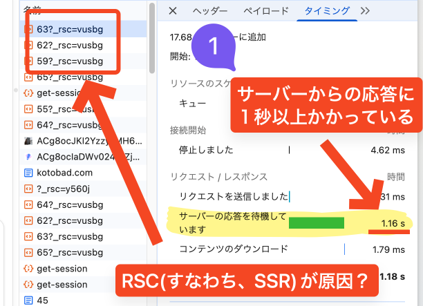

## APiのレスポンス時間計測 

### 概要

`curl`コマンドを使ってAPIのレスポンス時間を計測する

### 背景



1. ページ遷移が遅い
2. ネットワークタブから、時間食ってるやつを探す
3. `RSC`で時間食っていると分かる(SSRなので、DBリクエストなど)
4. API自体のレスポンス時間を計測する

### 対応内容

```
$ curl -s -D /tmp/h -o /tmp/b -w 
    \'http_code:%{http_code}\nttfb:%{time_starttransfer}\nsize:%{size_download}\n'
    \https://api.kotobad.com/bbs/threads/full/50

http_code:200
ttfb:0.439683
size:1037
```
#### コード概要
* `curl`のオプション
    * `-s`: (silent)色々出力せず省略
    * `-D`: HTTPレスポンスヘッダーを出力する
    * `-o`: 出力先を指定する

?> **/tmpとは**: 
一時的に保存できる場所らしい。
`sed`とか、`head`で後で処理すると分かってる場合に使えるね

### 結果
1KBとか返ってくるのに、0.4秒かかってる。
遅い、かも

### 次やること
バックエンドの処理(恐らく、`await getThreadWithTags()`)がボトルネックになっていると判明している。
`console.time`などを使って、詳しく原因を探す。
