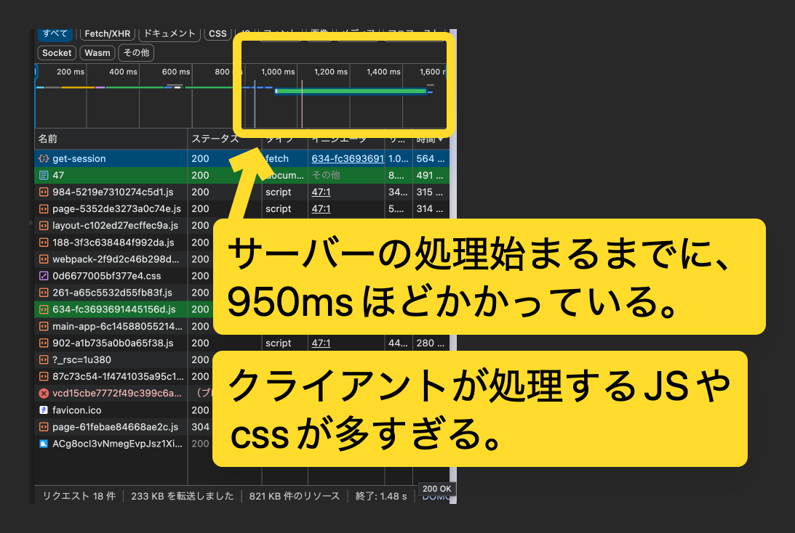
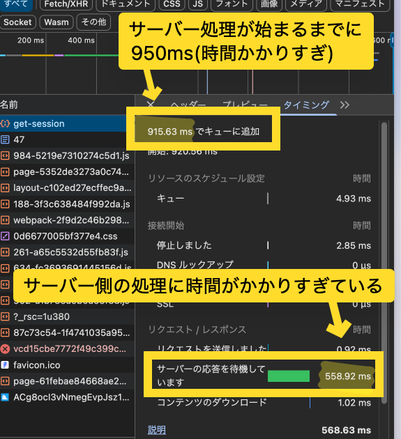

> **資料の位置づけ（2026-08-13追記）**
>
> 以下は2026-02-01時点の調査メモです。画像上の待機時間は実測ですが、「クライアントJS/CSSが多い」「API・DB・SSRのどこが遅い」という原因候補は、この画像だけで確定したものではありません。現行環境での再計測は確認できていません。

## 画面遷移時間を短く(フェーズ1)

### 概要
サーバー側の処理を高速化することを優先する
### 背景
スレッド詳細ページへ遷移するのが遅い。
ネットワークタブを見ると、まずサーバー処理が始まるのが遅い(950ms経ってからサーバー処理開始)と分かった。

サーバー処理開始した後でも、レスポンスが遅い。(サーバー側の処理に時間がかかっている)

まとめると、
1. クライアント側で実行するJSなどが多く、SSRのレンダリングが始まらない
2. SSRが始まっても、APIやDBリクエストなど、バックエンド処理に時間がかかっている

どちらを先に対応するか。

### 対応内容

結論: サーバー側の処理を高速化することを優先する

理由: クライアントの最適化は、PCやモバイルなど環境によって結果が異なる可能性がある。
サーバーはクライアントに関係なく、直で高速化に繋がるので、先にやりたい。

### 次やること

1. サーバー側のどの処理がボトルネックになっているのか調査する
2. `console.time`などを使ったりする

ボトルネック処理候補
* `await getThreads()`
    * `await`が原因？
* DBへのリクエスト
* SSR内の、何かのレンダリング

クライアントのJSを減らしたり、遅延読み込みで対応
### 参考
